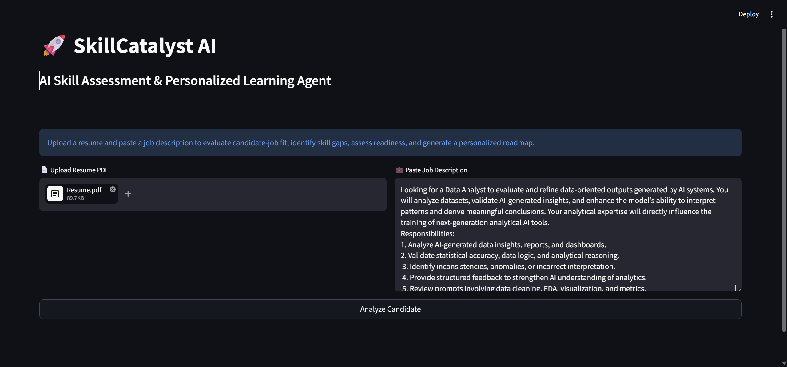
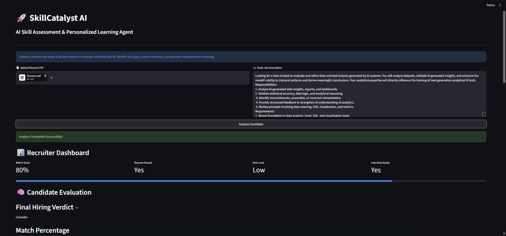
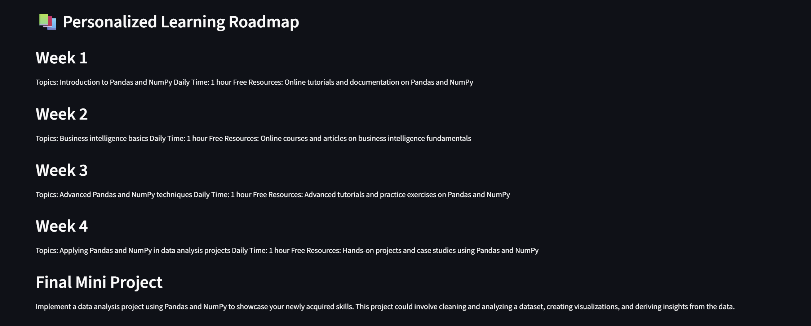
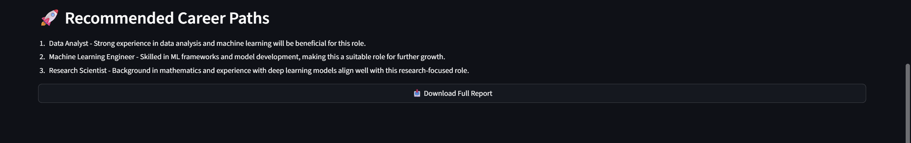

# 🚀 SkillCatalyst AI

## AI Skill Assessment & Personalized Learning Agent

SkillCatalyst AI is an intelligent hiring assistant built for the **Deccan AI Catalyst Hackathon**.

It helps recruiters go beyond resumes and understand whether a candidate is truly suitable for a job role.

The system compares a **Resume + Job Description**, evaluates candidate-job fit, identifies missing skills, gives hiring insights, and creates a personalized learning roadmap.

---

## 🎯 Problem Statement

A resume shows what a candidate claims to know, but not how well they know it.

This project solves that problem by building an AI-powered agent that:

- Reads candidate resume
- Reads job description
- Finds matching skills
- Detects missing skills
- Calculates fit score
- Gives hiring recommendation
- Creates 30-day learning roadmap
- Suggests future career paths

---

## 🛠️ Tech Stack

- Python
- Streamlit
- OpenRouter API
- GPT Model
- PyPDF2
- dotenv

---

## 📂 Project Structure

```bash
SkillCatalyst-AI/
│── app.py
│── requirements.txt
│── README.md
│── .gitignore
│── .env (local only)

```

---

## ⚙️ Installation & Setup

1️. Clone Repository

```bash
git clone https://github.com/Sonalikasingh17/SkillCatalyst-AI.git
cd SkillCatalyst-AI 
```

2. Create Virtual Environment

```bash

python -m venv venv
```

# Activate environment:
```
venv\Scripts\activate # On Windows

source venv/bin/activate  # On mac/Linux

```

3️. Install Requirements

```bash
pip install -r requirements.txt
```

4️. Create .env File
Create a file named .env in the project root directory and add your OpenRouter API key:

```env
OPENROUTER_API_KEY=your_api_key_here 
```

5️. Run Streamlit App

```bash
streamlit run app.py
```

--- 

## 💡 How It Works

### Input:
- Upload Resume PDF 
- Paste Job Description

### 🧪 Sample Test Input
For easy testing and review, the sample resume and job description I used in this project are included in the **sample_input/** folder of this repository.

### Output:
- Match Score
- Hiring Verdict
- Strengths
- Missing Skills
- Hiring Risks
- Interview Questions
- Learning Roadmap
- Career Suggestions
- [Download Sample Report](sample_output/sample_report.txt)

---

## 📸 Screenshots

### Home Page


### Recruiter Dashboard


### Candidate Evaluation
.png)
.png)

### Learning Roadmap


### Recommended Career Paths


---

## 🎥 Demo Video

Demo Link: [SkillCatalyst AI Demo](https://www.loom.com/share/your-demo-video-link)

--- 

## 🧠 Agentic AI Logic

This project acts like an AI hiring agent:

1. Understands resume data
2. Understands job requirements
3. Makes reasoning-based comparisons
4. Decides candidate fit score
5. Recommends actions
6. Generates roadmap automatically

This makes it more than a chatbot — it behaves like a task-solving AI assistant.

---

## 📌 Example Use Cases

- Recruiters screening candidates
- HR teams saving manual effort
- Students checking job readiness
- Career planning
- Skill gap analysis

---


## 🔒 Security

- API key stored in .env
- .env excluded using .gitignore

---

## 🚀 Future Improvements
- Multi-resume comparison
- Voice interview mode
- Live coding assessment
- Better scoring engine
- Dashboard analytics

---

## 👩‍💻 Author

**Sonalika Singh**  
IIT Madras  
Mathematics Postgraduate  
Data Science & AI Enthusiast

GitHub: https://github.com/Sonalikasingh17

--- 

## ⭐ Final Note

This project was built under hackathon deadline pressure with focus on solving a real hiring problem using practical AI tools.


